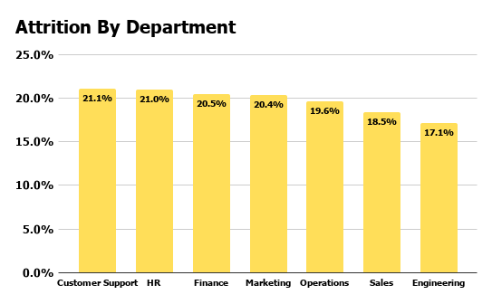
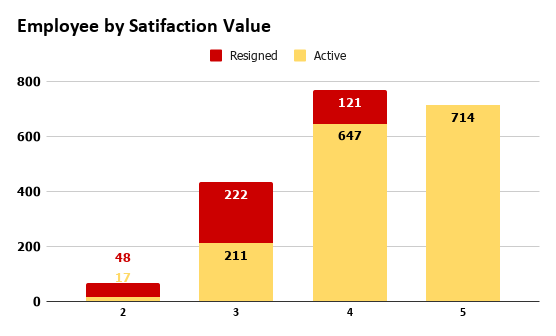
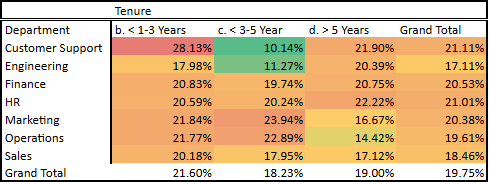

# 🏢 TalentHub HR Retention Analysis

> Employee attrition analysis for an HR consulting firm to identify resignation risk factors and deliver data-driven strategic recommendations.


---

## 📌 Background

Every employee who resigns doesn't just mean losing one person — it also means lost productivity, increased recruitment costs, disrupted team stability, and reduced service quality for clients.

**TalentHub Indonesia** is an HR consulting company serving over 100 corporate clients. A high attrition rate creates operational risks and can hinder business growth. This analysis was conducted to:

- Understand employee resignation patterns by department and tenure
- Identify the key risk factors driving attrition
- Help management make informed, data-driven decisions

**Presented to:** Pak Hendro — HR Director, TalentHub Indonesia

---

## ❓ Key Questions

1. Which department has the highest employee turnover?
2. What employee profile is most at risk of resigning?
3. What factors most significantly influence attrition?

---

## 📊 Dataset

| Info | Detail |
|---|---|
| Data period | 2018 – 2026 |
| Total employees (clean) | 1,980 |
| Raw rows | 2,011 |
| Anomalies found | 30 rows (missing values + duplicates) |
| Key columns | `department`, `salary`, `satisfaction`, `performance`, `work_hours`, `promotion_history`, `resign_status`, `tenure` |

> ⚠️ This dataset is internal company data. The full dataset is not publicly shared. A sample version is available for portfolio review purposes.

---

## 🛠️ Tools Used

| Tool | Purpose |
|---|---|
| **Google Sheets** | Data cleaning, preprocessing, pivot analysis, and dashboard |
| **Canva** | Report visualization & presentation storytelling |

🔗 [View Google Sheets (view only)](https://docs.google.com/spreadsheets/d/1Y5oFu8jkWHvGFuRvMw_ZcAjYE6GOuiql/edit?usp=sharing)

---

## 🧹 Data Cleaning Summary

All cleaning was performed in Google Sheets using built-in formulas.

| Anomaly Type | Count | Action | Formula Used |
|---|---|---|---|
| Missing values (Salary / Perf / Satisfaction) | 20 | Exclude rows | `COUNTBLANK(Salary) + COUNTBLANK(Perf) + COUNTBLANK(Sat)` |
| Duplicate rows (exact match) | 10 | Keep first, drop rest | `COUNTA(rows) - ROWS(UNIQUE(all cols))` |
| **Total anomalies** | **30** | | |

**Result:** 2,011 raw rows → **1,980 clean rows** (cross-checked via `COUNTA` on clean data)

---

## 🔍 Key Findings

### 1. Attrition Rate by Department

| Department | Total Employees | Resigned | Attrition Rate |
|---|---|---|---|
| Customer Support | 270 | 57 | **21.1%** ← highest |
| HR | 276 | 58 | 21.0% |
| Finance | 302 | 62 | 20.5% |
| Marketing | 260 | 53 | 20.4% |
| Operations | 311 | 61 | 19.6% |
| Sales | 298 | 55 | 18.5% |
| Engineering | 263 | 45 | **17.1%** ← lowest |
| **Grand Total** | **1,980** | **391** | **19.75%** |



---

### 2. Job Satisfaction as the Primary Predictor

Employees with low satisfaction scores are significantly more likely to resign:

| Satisfaction Score | Total | Resigned | Resign Rate |
|---|---|---|---|
| 1 | 45 | 34 | 75.6% |
| 2 | 392 | 211 | 53.8% |
| 3 | 748 | 145 | 19.4% |
| 4 | 585 | 1 | 0.2% |
| 5 | 208 | 0 | 0.0% |

**Summary:**
- Satisfaction < 3 (Low): 437 employees → **56.1% resign rate**
- Satisfaction ≥ 3 (High): 1,542 employees → **9.5% resign rate**



---

### 3. Critical Tenure Window: Year 2–3

| Tenure Bucket | Total Employees | Resigned | Attrition Rate |
|---|---|---|---|
| 0–2 years | 171 | 28 | 16.4% |
| **2–3 years** | **299** | **70** | **23.4%** ← highest |
| 3–5 years | 561 | 119 | 21.2% |
| 5+ years | 947 | 174 | 18.4% |

Resignation risk peaks during **year 2 to 3**, indicating a critical early tenure window that requires proactive intervention before employees decide to leave.



---

## 💡 Recommendations

### 1. Prioritize Retention Efforts in Customer Support
The department with the highest attrition rate (21.1%). Recommended actions: conduct in-depth exit interviews, review workload distribution, and establish a clear career path from support → team lead → manager. Allocate retention budget proportionally to this department.

### 2. Implement a Satisfaction-Based Early Warning System
Employees with satisfaction < 3 have a 56.1% resign rate. Run monthly pulse surveys and automatically place at-risk employees on a watchlist for 1-on-1 sessions with their manager. Intervening early delivers the highest ROI by preventing resignations before they happen.

### 3. Launch a Year 2 Retention Program
Attrition peaks at the 2–3 year tenure mark (23.4%). Build a structured **"Year 2 Check-in"** program covering career conversations, compensation reviews, and personal development plans. Don't wait for employees to resign before taking action.

---

## 📈 Business Impact

Implementing these three recommendations has the potential to deliver:
- **Reduced attrition rate** across all departments
- **Lower recruitment costs** (estimated at 50–200% of annual salary per position)
- **Improved team stability** and increased satisfaction for TalentHub's corporate clients

---

## 📁 Project Structure

```
talenthub-hr-retention/
├── README.md
├── .gitignore
├── data/
│   ├── talenthub_clean.csv
│   └── data_dictionary.md
├── cleaning/
│   ├── cleaning_log.md
│   └── google_sheets_link.md
└── reports/
    ├── figures/
    └── TalentHub_HR_Retention.pdf
```

---

## 👤 Author

**Rafly Sean Antonio** — Data Analyst

[](https://linkedin.com/in/seanant)
[](mailto:rseanantonio@gmail.com)

---

*This project is part of a data analyst portfolio. The dataset used is a simulation for learning and skill demonstration purposes.*
